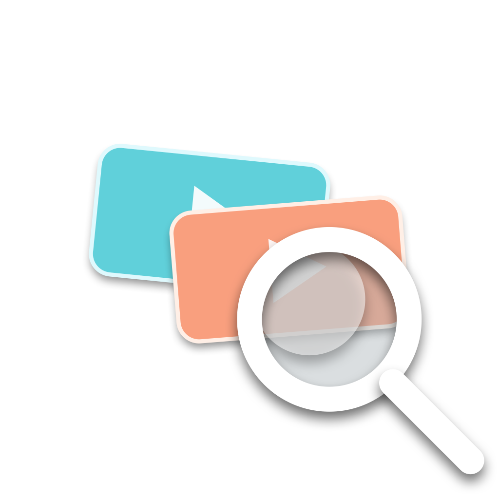
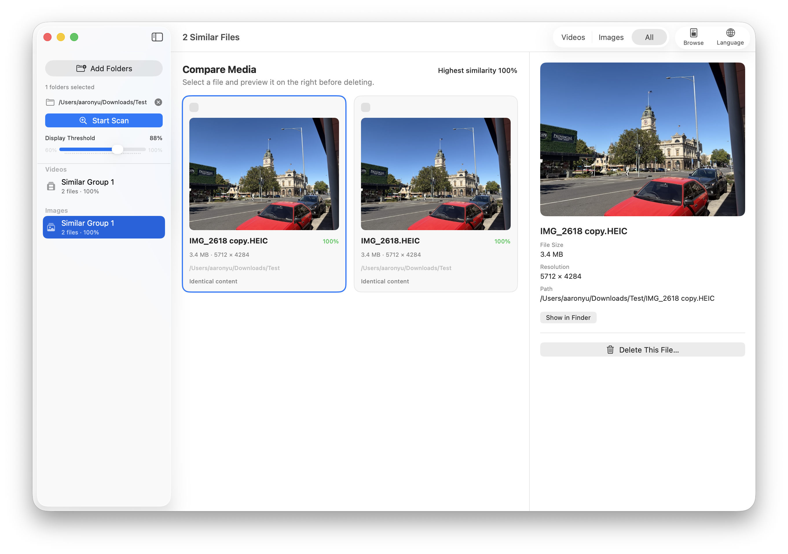
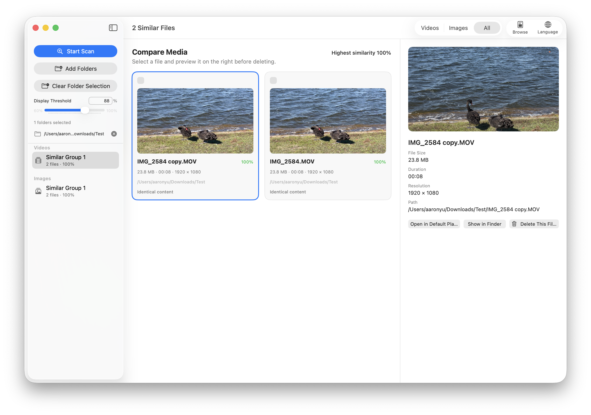
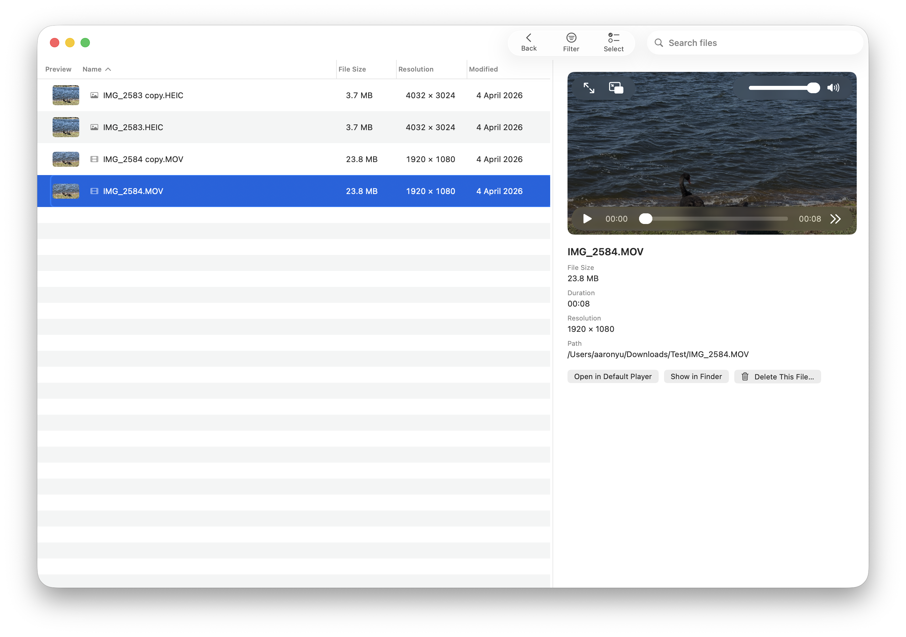

#  Targie

[English](README.md) | [简体中文](README_ZH.md) | [Español](README_ES.md) | [Français](README_FR.md)

> **僅支援 macOS。** Targie 是一款原生 macOS 14+ 應用程式，沒有 Windows 或 Linux 版本，也不計劃提供。

Targie 透過結合 metadata、內容雜湊、感知指紋與視覺特徵，在多個所選資料夾之間尋找相似影片與圖片。

## 功能

- 可切換「影片」「圖片」「全部」三種掃描模式，並記住上次選擇。
- 可透過資料夾選擇器或 Finder 拖放同時新增多個資料夾，並跨目錄統一比較媒體檔案。
- 遞迴掃描常見影片格式，以及 JPEG、PNG、HEIC、HEIF、WebP、TIFF、GIF 和 BMP 圖片。
- 綜合 SHA-256、可快取的感知指紋、metadata 與可重複使用的 Vision 特徵，無法讀取的檔案不會中斷掃描。
- 影片與圖片分開分組，支援並排檢查與應用程式內靜態預覽。
- 可用預設播放器開啟影片，並可在 Finder 中顯示任意媒體檔案。
- 支援明確勾選多個檔案後批次刪除，部分失敗時保留失敗項目並顯示錯誤。
- 刪除時必須選擇移至垃圾桶或永久刪除，永久刪除會再次確認。
- 支援英文、簡體中文、繁體中文、西班牙文與法文即時切換，並記住上次選擇的語言。
- **瀏覽模式**：以可排序、可篩選的表格瀏覽所選資料夾中所有檔案，支援拖曳調整欄寬、批次選取，視窗標題即時顯示篩選後的檔案數量。







## 安裝

1. 從 [Releases](https://github.com/LiruiYu33/Targie-The-Similar-Videos-Images-Finder/releases) 下載最新的 `Targie-v*.zip`。
2. 解壓後將 **Targie.app** 拖入「應用程式」資料夾（或其他任意位置）。
3. 本 App 使用臨時簽署，首次啟動時 macOS 門禁會攔截：
   - **右鍵**（或按住 Control 點擊）App → **打開** → 在對話框中點選 **打開**。
   - 或者前往 **系統設定 → 隱私與安全性**，捲動到底部，在 Targie 條目旁點選 **仍然允許**，然後正常開啟 App。
   - 只需操作一次。首次成功啟動後門禁不會再攔截。

## 建置（僅 macOS）

```bash
swift test
./script/build_app.sh
```

產生的應用程式位於：

```text
dist/Targie.app
```

開發時可以建置並啟動：

```bash
./script/build_and_run.sh
```

應用程式使用臨時簽名，適合本機使用。如需透過網路或 App Store 分發，還需要 Developer ID、應用程式公證與對應的封裝流程。

## 開源授權

Targie 採用 **[GNU General Public License v3.0](LICENSE)** 協議開源。

Copyright (C) 2026 Lirui Yu。

如果你重複使用本倉庫的程式碼（無論是否修改）：

- **必須**保留版權聲明，並署名原作者（Lirui Yu）。
- 任何對外分發的衍生作品**必須**同樣以 GPL-3.0（或更新的 GPL 版本）開源，並向使用者提供完整原始碼。
- **不允許**閉源或私有化再分發。

完整法律條款請見 [LICENSE](LICENSE) 檔案。

## 貢獻

歡迎提交 Pull Request。每個 commit 必須按 [Developer Certificate of Origin (DCO)](DCO) 簽署，即在 `git commit` 時加上 `-s` 參數。詳見 [CONTRIBUTING.md](CONTRIBUTING.md)。
